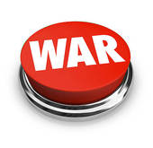

#The Game of War

##Overview
---

War is a simple card game played between two players in which the deck is divided evenly.  Whoever has the higher card value wins the round. Players play until all the cards are used.  The winner of the game is then determined by which player has the most cards. 

##The Deal
---
The deck is divided evenly, with each player receiving 26 cards, dealt one at a time, face down. Anyone may deal first. Each player places his stack of cards face down, in front of him.

##The Play
---
Each player turns up a card at the same time and the player with the higher card takes both cards and puts them, face down, on the bottom of his stack.

If the cards are the same rank, it is War. Each player plays one card face down.  They then play a second card face up. The player with the second higher card wins, and takes both piles (six cards). If the turned-up cards are again the same rank, each player places another card face down and turns another card face up. The player with the higher card takes all 10 cards, and so on.

##How To Keep Score
---
The game ends when all the cards are used. The player with the most cards wins the round. 

